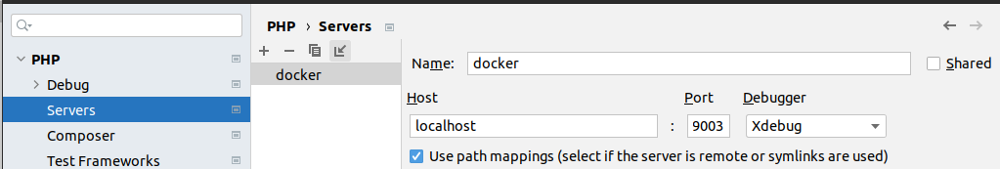
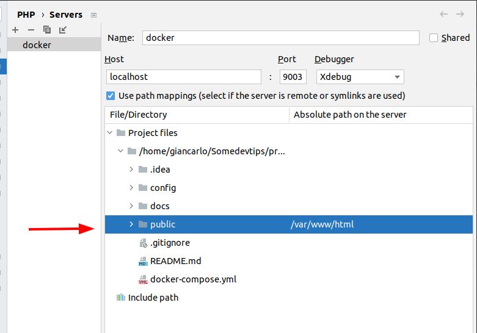
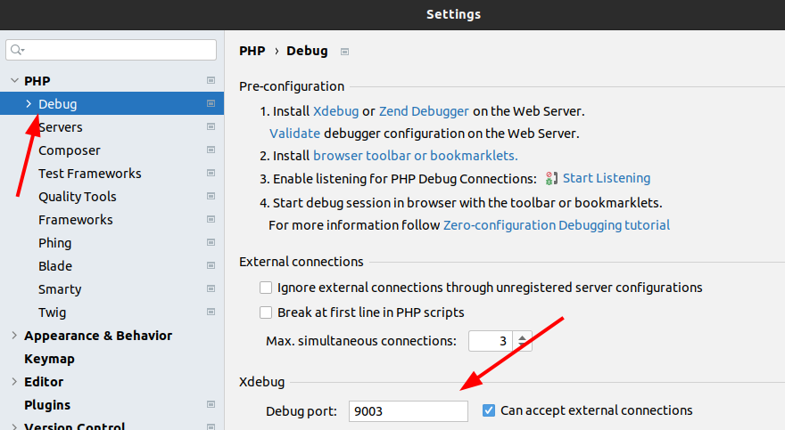
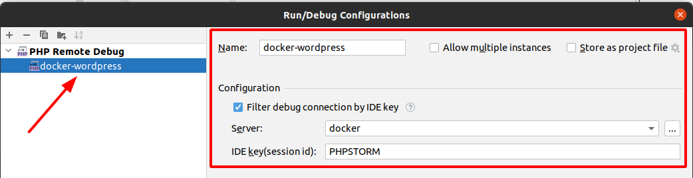
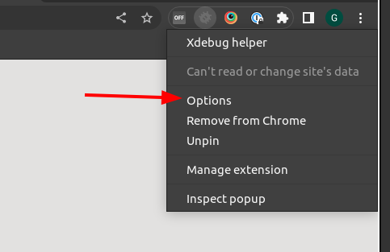
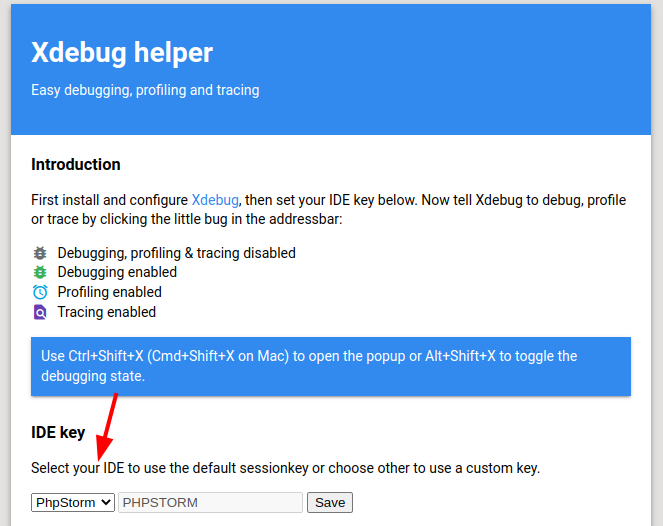
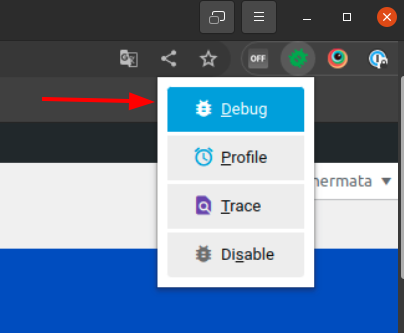

# Docker WordPress
Docker setup for WordPress, with WP CLI, Xdebug, Composer, Adminer

## Setup
1. Customize Apache virtual host configuration in file `config/apache/wordpress-site.conf`, if needed  
2. Customize Xdebug configuration in file `config/php/xdebug.ini`, if needed
3. Customize PHP configuration in file `config/php/zcustom.ini`, if needed
4. Run `docker-compose up -d`, it will build the docker images and start the containers
5. Visit [http://localhost](http://localhost) and install WordPress, the username and 
password of the Administrator are `admin`
6. The WordPress files are mapped to the `public` directory

## Tools
Adminer: [http://localhost:9999/](http://localhost:9999/), the username and
password are `root`

## PhpStorm debugger setup
The Xdebug configuration is defined in [config/php/xdebug.ini](config/php/xdebug.ini)
To configure PhpStorm:
1. Go to File->Settings->PHP->Servers, add a new server named `docker` with the settings below:
 
2. In the same settings page as above, map the following paths (see screenshot below):  
`public` -> `/var/www/html`  

3. Go to File->Settings->PHP->Debug->Xdebug and set the port number to 9003:
   
4. Go to Run->Edit Configurations and create a new configuration with the following settings:
   
5. Install one of the following extensions, depending on the browser you use: 
[https://www.jetbrains.com/help/phpstorm/2022.3/browser-debugging-extensions.html](https://www.jetbrains.com/help/phpstorm/2022.3/browser-debugging-extensions.html)
6. If you use Chrome, configure the extension Xdebug helper:  
   a. Right click the extension and choose Options:  
     
   b. Set the IDE key to PhpStorm and save:   
     
   c. Activate the debug configuration in the extension:  
     

## PHP and Apache customization
Apache Virtualhost can be customized in the file `config/apache/wordpress-site.conf`  
php.ini settings can be overriden with the file `config/php/zcustom.ini`

## Common commands
Start and stop:  
`docker-compose up -d`  
`docker-compose stop`

Open a terminal inside the webserver container as root:  
`docker-compose exec wordpress bash`

Open a terminal inside the webserver container as the user that runs the web server:  
`docker-compose exec -u www-data wordpress bash`

Open a terminal inside the database container to use MySQL CLI:  
`docker-compose exec db bash`  
`mysql -u root -proot`  

Rebuild the wordpress container after a change to the Dockerfile:  
`docker-compose build`

## Error logs

### Apache

Error log is `/var/log/apache2/error-wordpress-site.log`, to see in real time run:  
```bash
docker-compose exec wordpress tail -f /var/log/apache2/error-wordpress-site.log
```

### PHP

File: `/var/log/apache2/php-errors.log`  
The location can be changed in the file `config/php/zcustom.ini`, parameter `error_log`

